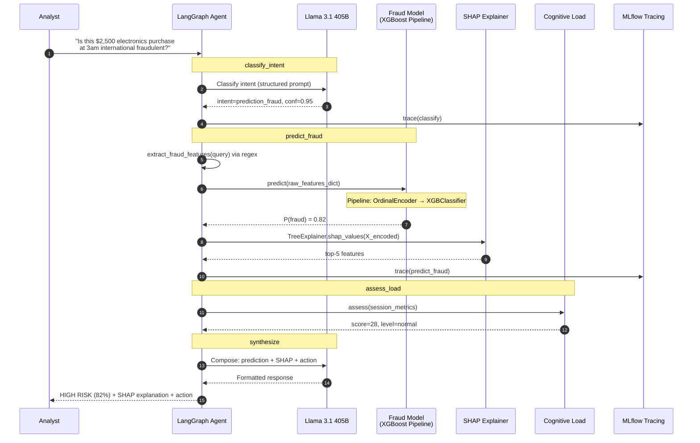

# Fraud Copilot
### AI Agent for Financial Fraud Analysts | Databricks + LangGraph + MLflow 3

> A multi-tool conversational agent that combines SQL analytics, ML predictions with SHAP explanations, and RAG over regulatory documents — designed to augment fraud analysts, not replace them.

**Author:** Diego Cortes | **Date:** March 2026  
**Assessment:** Gen AI Engineer — Lovelytics

---

## Architecture

Full architecture document: [`docs/architecture.md`](docs/architecture.md)

```
Analysts → Databricks App (Chat UI)
               │
               ▼
     Model Serving Endpoint
     ┌─────────────────────────────────────┐
     │     LangGraph StateGraph            │
     │                                     │
     │  classify ──→ data_query      ──┐   │
     │     │──────→ predict_fraud    ──┤   │
     │     │──────→ predict_purchase ──┼→ assess_load → synthesize → OUT
     │     │──────→ search_knowledge ──┤   │
     │     └──────→ complex_analysis ──┘   │
     │                                     │
     │  mlflow.langchain.autolog() tracing │
     └─────────────────────────────────────┘
               │           │          │
               ▼           ▼          ▼
         SQL Warehouse  Model Srv  Vector Search
         (Delta tables) (XGBoost   (Financial KB)
                        LightGBM)
```


---

## Key Results

| Metric | Value | Notes |
|--------|-------|-------|
| Fraud Model ROC-AUC | 5-fold CV, Stratified | XGBoost Pipeline (OrdinalEncoder + Classifier) |
| Purchase Model R² | GroupKFold by tier | LightGBM Pipeline (OrdinalEncoder + Regressor) |
| Agent Routing Accuracy | 30-query golden set | LLM-based intent classifier with 5 categories |
| Agent Content Relevance | Keyword match scoring | Evaluated across data, prediction, knowledge, complex |
| SHAP Explanations | Per-prediction | Top-5 features with directional impact |
| RAG Citations | Vector Search + TF-IDF fallback | Source documents cited in every knowledge response |

> **Note:** Exact metric values are populated after execution on the Databricks workspace. The evaluation notebook (`06_evaluation.py`) logs all results to MLflow automatically. The models are trained on synthetic 100-row datasets; metrics will shift with production data.

### Model Performance Summary

**Fraud Detection (XGBoost Pipeline):**
- 5-fold Stratified CV with variance reporting
- Pipeline architecture: `ColumnTransformer(OrdinalEncoder) → XGBClassifier`
- Model accepts raw data (strings for categoricals) — no train-serve skew
- SHAP waterfall + summary plots logged as MLflow artifacts

**Purchase Prediction (LightGBM Pipeline):**
- GroupKFold by `membership_tier` (ensures tier representation per fold)
- Log1p target transform if skewness > 2
- Per-tier segmented evaluation (RMSE, MAE per membership tier)

### Agent Evaluation Summary

The golden set contains 30 queries distributed across 5 intent types:

| Intent Type | Queries | Expected Behavior |
|-------------|---------|-------------------|
| Data Analysis | 10 | SQL-like queries against Delta tables |
| Fraud Prediction | 6 | Model inference + SHAP explanation |
| Purchase Prediction | 4 | Regression inference + confidence interval |
| Knowledge (RAG) | 5 | Vector search with document citations |
| Complex Analysis | 5 | Multi-step: data retrieval + model predictions |

Evaluation is executed in 5 batches of 6 queries to respect Foundation Model API rate limits on the free tier.

---

## Quick Start

### 1. Environment Prerequisites (Manual Setup)

The following configurations were made via the Databricks UI before running any notebook:

- **Unity Catalog:** Created a catalog named `fraud_agent` with a schema named `default`.
- **LLM Endpoint:** Provisioned a Foundation Model endpoint `databricks-meta-llama-3-1-405b-instruct` via Mosaic AI Model Serving.
- **Vector Search Endpoint:** Created `fraud-copilot-vs-endpoint` (STANDARD type) for RAG retrieval.
- **Cluster Libraries:** All Python dependencies were installed manually via the cluster UI (Cluster → Libraries → Install New → PyPI) because `%pip install` is unreliable on the free-tier Community Edition. See [Implementation Notes](#implementation-notes) for details.
- **Directory Structure:** Created a dedicated Workspace folder to host the notebooks.

### 2. Execution Order

| Step | Notebook | What it does |
|------|----------|--------------|
| 0 | `00_setup_and_data_load.py` | Load CSVs → Delta tables, chunk markdown docs, create Vector Search index |
| 1 | `01_fraud_model_training.py` | Train XGBoost pipeline, 5-fold CV, SHAP, register in Unity Catalog |
| 2 | `02_purchase_model_training.py` | Train LightGBM pipeline, GroupKFold, SHAP, register in Unity Catalog |
| 3 | `03_agent_tools.py` | Initialize tools: data queries, model inference, RAG search, cognitive load |
| 4 | `04_agent_graph.py` | Build LangGraph StateGraph, configure LLM, test routing per intent |
| 5 | `05_agent_demo.py` | Interactive demo: 8 queries across all intent types |
| 6 | `06_evaluation.py` | Golden set evaluation (30 queries), metrics logged to MLflow |

---

## Implementation Notes

### Iteration Log

This section documents key iterations and challenges encountered during prototype development.

**1. Library Installation on Databricks Free Tier**

The `%pip install` magic command does not work reliably on the Databricks Community Edition / free-tier clusters. Packages either fail to install or do not persist after cluster restart. The workaround was to install all required libraries manually through the cluster UI: **Cluster → Libraries → Install New → PyPI**. Libraries installed this way:
- `xgboost`, `lightgbm`, `shap`
- `langgraph`, `databricks-langchain`
- `mlflow` (pre-installed but version-pinned)
- `scikit-learn` (pre-installed)

This is a known limitation of the free tier and would not apply in a production workspace where `%pip install` or init scripts work normally.

**2. Data Type Mismatch in Model Serving**

During initial model registration, the fraud model was trained with pre-encoded integer features (OrdinalEncoder applied outside the pipeline). When the agent sent raw string data (e.g., `"electronics"` for `merchant_category`), the model rejected the input with a type mismatch error.

**Root cause:** The preprocessing step was not packaged inside the sklearn Pipeline. The model signature expected integers, but the agent provided strings.

**Fix:** Refactored both models to use `sklearn.Pipeline` with `ColumnTransformer(OrdinalEncoder)` as the first step. The registered model now accepts raw data directly, eliminating train-serve skew. This is reflected in notebooks 01 and 02 where the pipeline architecture is: `ColumnTransformer(passthrough + OrdinalEncoder) → Classifier/Regressor`.

**3. SHAP Compatibility with Pipeline Models**

`shap.TreeExplainer` cannot operate on a full sklearn Pipeline — it requires the underlying tree model directly. The solution was to load the model twice:
- As `mlflow.pyfunc` for inference (accepts raw data via pipeline)
- As `mlflow.sklearn` for SHAP access (extract `pipeline.named_steps["classifier"]` and `pipeline.named_steps["preprocessor"]`)

SHAP values are computed on the preprocessor-transformed data, then mapped back to the original feature names.

**4. Vector Search Index Sync Timing**

The Vector Search index creation is asynchronous. On first run, the index may not be ready when notebook 03 attempts to use it. The RAG tool includes a TF-IDF fallback that activates automatically when Vector Search is unavailable or the index is not yet synced.

**5. LLM Rate Limits During Evaluation**

The Foundation Model API on the free tier enforces rate limits (~20 requests/minute). The evaluation notebook (06) splits the 30-query golden set into 5 batches of 6 queries each, with manual cell execution between batches to allow rate limit recovery.

**6. int64 to int32 Casting**

Pandas defaults to `int64` for integer columns, but the MLflow model signature (inferred from training data) sometimes expects `int32`. Both model tools explicitly cast `int64` columns to `int32` before prediction to prevent signature validation errors.

---

## Repository Structure

```
fraud-copilot/
├── README.md                        ← You are here
├── docs/
│   └── architecture.md              ← Full architecture + design decisions (English)
├── notebooks/                       ← Databricks notebooks (numbered execution order)
│   ├── 00_setup_and_data_load.py
│   ├── 01_fraud_model_training.py
│   ├── 02_purchase_model_training.py
│   ├── 03_agent_tools.py
│   ├── 04_agent_graph.py
│   ├── 05_agent_demo.py
│   └── 06_evaluation.py
├── src/                             ← Production-ready Python modules
│   ├── __init__.py
│   ├── tools/
│   │   ├── __init__.py
│   │   ├── data_tools.py            ← SQL-like queries against Delta tables
│   │   ├── model_tools.py           ← ML inference + SHAP explanations
│   │   └── rag_tools.py             ← RAG retrieval with citations
│   ├── agent/
│   │   ├── __init__.py
│   │   ├── nodes.py                 ← LangGraph node implementations
│   │   ├── policies.py              ← Guardrails + cognitive load assessor
│   │   └── graph.py                 ← StateGraph composition + routing
│   └── evaluation/
│       ├── __init__.py
│       └── golden_set.py            ← 30 evaluation queries with expected results
├── tests/
│   ├── __init__.py
│   └── test_components.py           ← Unit tests (pytest)
├── config/
│   ├── agent_config.yaml            ← Policies, thresholds, endpoint names
│   └── model_config.yaml            ← Training hyperparameters, feature lists
├── data/
│   ├── fraud_dataset.csv
│   ├── product_purchase_dataset.csv
│   └── financial_documents/         ← Markdown knowledge base
└── exports/                         ← Notebooks exported as HTML (with outputs)
```

---

## Design Decisions

| Decision | Rationale | Trade-off |
|----------|-----------|-----------|
| **LangGraph** over OpenAI Agents SDK | Visual graph for demo, explicit state machine, testable routing, native MLflow tracing | Framework dependency, LangChain abstractions |
| **Databricks-centric** | Single platform for data + models + agent + eval + governance | Vendor lock-in |
| **XGBoost / LightGBM** over deep learning | 100-row datasets need low-complexity models; SHAP-compatible for explainability | Lower ceiling with massive data |
| **Pipeline-encapsulated preprocessing** | Eliminates train-serve skew; model accepts raw data | Slightly more complex SHAP extraction |
| **Cognitive load module** | Analyst augmentation differentiator (not just another chatbot) | Heuristic-based, needs validation with real data |
| **Deploy code MLOps pattern** | Reproducible retraining, automated validation gates | More CI/CD setup upfront |
| **TF-IDF fallback for RAG** | Guarantees RAG works even if Vector Search index is not ready | Lower retrieval quality than embeddings |
| **LLM-based intent classifier** | No training data needed for prototype; handles diverse phrasing | Higher latency/cost vs. dedicated classifier |

---

## Technology Stack

| Component | Technology | Purpose |
|-----------|-----------|---------|
| Platform | Databricks (Free Tier for prototype) | Unified data + AI |
| Orchestration | LangGraph (StateGraph) | Multi-tool agent with conditional routing |
| ML Models | XGBoost, LightGBM (sklearn Pipeline) | Fraud detection, purchase prediction |
| Experiment Tracking | MLflow 3 | Metrics, artifacts, model registry (Unity Catalog) |
| Observability | MLflow Tracing (`mlflow.langchain.autolog()`) | Auto-trace every agent node |
| Data | Delta Lake + Unity Catalog | Governed, versioned tables |
| RAG | Databricks Vector Search + TF-IDF fallback | Financial knowledge retrieval with citations |
| Evaluation | Golden set (30 queries) + MLflow logging | Routing accuracy, content relevance, latency |
| Explainability | SHAP (TreeExplainer) | Per-prediction feature attribution |
| LLM | `databricks-meta-llama-3-1-405b-instruct` | Intent classification + response synthesis |

---

## What I'd Improve With More Time

1. **Semantic caching** — 25-40% of regulatory queries are repeated; vector similarity on previous queries would reduce LLM calls
2. **Fine-tuned intent classifier** — Dedicated distilbert model for routing instead of LLM; reduces latency and cost of the first hop
3. **Real-time streaming** — Databricks Structured Streaming for proactive fraud alerts
4. **Graph database** — Neo4j for entity relationship modeling (organized fraud ring detection)
5. **Production CI/CD** — Databricks Asset Bundles + GitHub Actions for automated deployment
6. **Cognitive load ML model** — Replace heuristic with a model trained on real analyst session data
7. **mlflow.genai.evaluate()** — Full LLM-as-judge scoring (Correctness, Groundedness, Safety) instead of keyword matching
8. **Multi-model A/B testing** — Compare LLMs per query type to optimize quality/cost ratio
