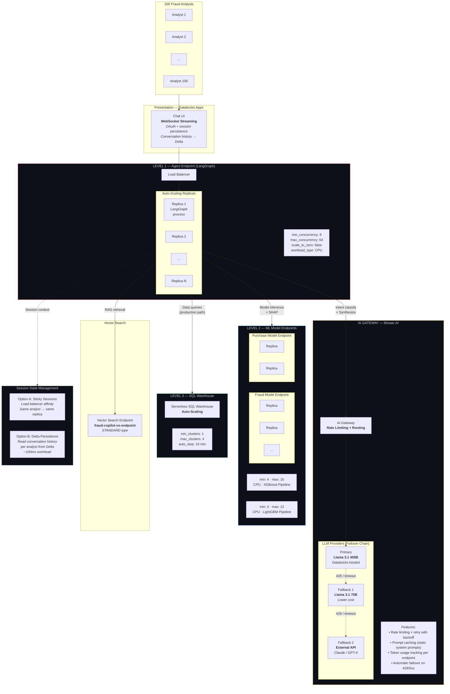
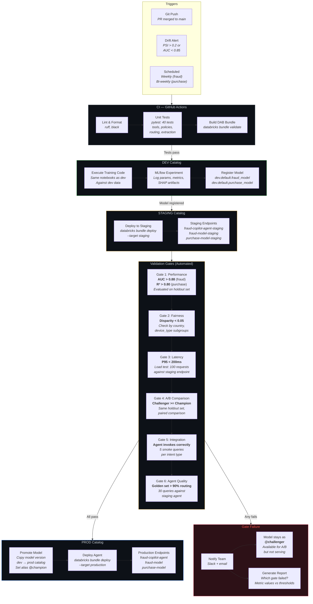
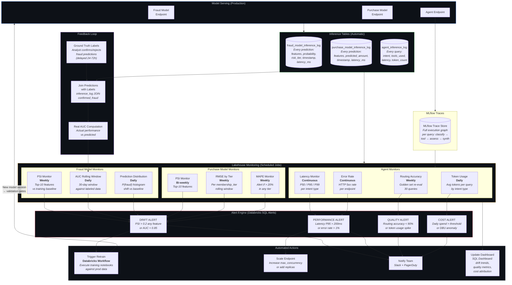
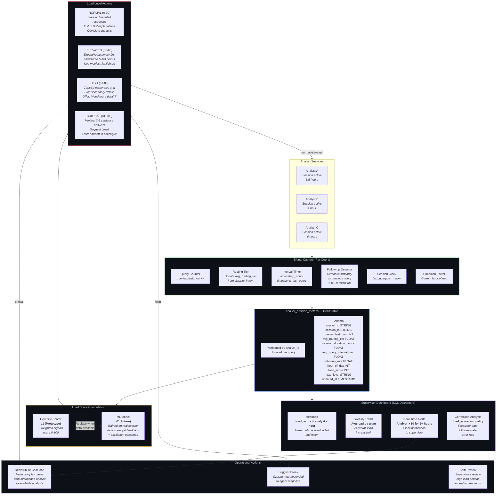
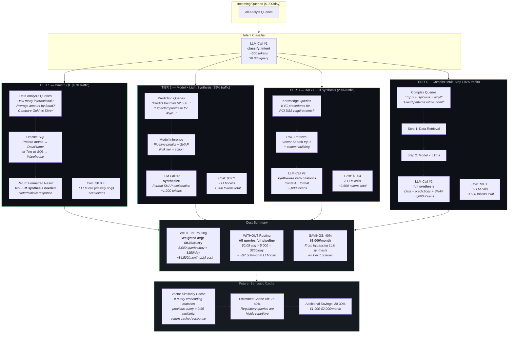

# Fraud Copilot: Architecture Document
## LangGraph-on-Databricks with Analyst Augmentation

**Lovelytics | Gen AI Engineer Technical Assessment**  
**Diego Cortes | March 2026**

---

## Table of Contents

1. [Business Understanding](#1-business-understanding)
2. [Fundamental Architectural Decisions](#2-fundamental-architectural-decisions)
3. [System Architecture](#3-system-architecture)
4. [Machine Learning Models](#4-machine-learning-models)
5. [MLOps Pipeline](#5-mlops-pipeline)
6. [Multi-Tool Agent Design](#6-multi-tool-agent-design)
7. [Concurrency and Scalability](#7-concurrency-and-scalability)
8. [LLM Evaluation and Control](#8-llm-evaluation-and-control)
9. [Analyst Augmentation: Cognitive Load](#9-analyst-augmentation-cognitive-load)
10. [Cost Analysis](#10-cost-analysis)
11. [Implementation Roadmap](#11-implementation-roadmap)
12. [Implementation Iterations and Lessons Learned](#12-implementation-iterations-and-lessons-learned)
13. [Trade-offs and Future Improvements](#13-trade-offs-and-future-improvements)

---

## 1. Business Understanding

### 1.1 The Real Problem

Fraud Copilot is not a chatbot. It is an **operational augmentation system** for financial fraud analysts. Business value is measured across fice axes:

| Value Axis | Impact |
|---|---|
| Average investigation time | operational time |
| Detection rate (recall) | more frauds detected |
| False positives investigated/day | less unnecessary work |
| Compliance errors per month | less regulatory risk |
| Average cost per investigation | reduction total cost |

### 1.2 Guiding Principle: Analyst Augmentation, Not Replacement

The system does not replace analysts with agents. It enables each analyst to handle more cases at higher quality. This manifests in three concrete capabilities:

**Capability 1 — Unified information access:** The analyst asks a natural language question and receives data, predictions, and regulatory knowledge in a single response, instead of consulting 3-4 separate tools.

**Capability 2 — Operational explainability:** Every fraud model prediction includes the features that contributed most to the decision and a recommended action ("verify identity", "block international transactions"), reducing interpretation time.

**Capability 3 — Cognitive load adaptation:** The system detects signals of operational fatigue and adjusts response complexity, protecting the quality of analyst decisions during high-load periods.

### 1.3 Analyst Workflows

A typical analyst executes a lot of investigations daily. Each investigation combines:

1. **Data queries** for transaction context 
2. **Risk evaluation** using predictive models
3. **Regulatory verification** against KYC/AML/PCI DSS documentation 
4. **Complex analyses** combining data + prediction + knowledge

---

## 2. Fundamental Architectural Decisions

### 2.1 Orchestration Framework: LangGraph

**Decision:** Use LangGraph as the agent authoring framework, wrapped with `ResponsesAgent` from MLflow for native Databricks compatibility.

**Alternatives evaluated:**

| Framework | Pros | Cons | Verdict |
|---|---|---|---|
| **LangGraph** | Visual graph, explicit state machine, native checkpointing, automatic MLflow tracing | Learning curve, inherited LangChain abstractions | **Selected** |
| OpenAI Agents SDK | Simple, native Databricks template, elegant handoffs | Tied to OpenAI as LLM provider, less flow control | Rejected |
| Agno | Lightweight, intuitive, native "teams" concept | Newer, less battle-tested in production | Future alternative |
| Pure Python (ChatAgent) | Maximum control, no external dependencies | No flow visualization, more boilerplate code | Rejected |

**Technical justification — three capabilities that alternatives do not match for this use case:**

1. **Graph visualization:** During a live demo, the exact flow of each query type through nodes can be shown — which decisions are made, where the flow branches. This is difficult to demonstrate with agents based solely on tool calling.
2. **Explicit state machine:** Conditional transitions between nodes are declarative and unit-testable, unlike a ReAct agent where the LLM decides the flow implicitly.
3. **Native Databricks integration:** MLflow Tracing automatically captures LangGraph execution via `mlflow.langchain.autolog()`, with no manual instrumentation.

**Risk mitigation:** If LangGraph causes production issues, migration cost is low because `ResponsesAgent` decouples the authoring framework from Databricks infrastructure. LangGraph can be replaced by Agno or pure Python by changing only the internal agent implementation, without touching serving, tracing, or evaluation.

### 2.2 Platform: Databricks-Centric

**Decision:** Concentrate data, models, agent, evaluation, and observability on Databricks.

**Justification:** Maintainability (single provider), security (Unity Catalog centralizes permissions), and compatibility (MLflow 3 traces the entire stack natively). The explicit trade-off is greater Databricks coupling in exchange for smaller operational surface.

### 2.3 MLOps Pattern: Deploy Code

**Decision:** Use the "deploy code" pattern recommended by Databricks, where what is promoted to production is the training code, not the model artifact.

**Justification:** Supports automated retraining in a controlled environment. Code is versioned in Git, executed in production against production data, and the resulting model is automatically validated before serving.

---

## 3. System Architecture

### 3.1 High-Level View

```
┌─────────────────────────────────────────────────────────────────────┐
│                    FRAUD ANALYSTS (up to 100)                       │
│                    Natural Language Interface                       │
└──────────────────────────┬──────────────────────────────────────────┘
                           │
                           ▼
┌─────────────────────────────────────────────────────────────────────┐
│              DATABRICKS APPS - Chat UI + Auth                       │
│              (WebSocket streaming, OAuth, session management)       │
└──────────────────────────┬──────────────────────────────────────────┘
                           │
                           ▼
┌─────────────────────────────────────────────────────────────────────┐
│          MODEL SERVING ENDPOINT: fraud-copilot-agent                │
│                                                                     │
│  ┌───────────────────────────────────────────────────────────────┐  │
│  │            LangGraph StateGraph                               │  │
│  │                                                               │  │
│  │  [classify_intent] ──→ [data_query]  ─────────┐               │  │
│  │        │                                      │               │  │
│  │        ├──────────→ [predict_fraud]  ──┐      │               │  │
│  │        │                               │      │               │  │
│  │        ├──────────→ [predict_purchase] ┤      │               │  │
│  │        │                               ├→ [assess_load]       │  │
│  │        ├──────────→ [search_knowledge] ┤      │               │  │
│  │        │                               │      ▼               │  │
│  │        └──────────→ [complex_analysis] ┘  [synthesize] → OUT  │  │
│  │                                                               │  │
│  │  mlflow.langchain.autolog() → automatic tracing               │  │
│  └───────────────────────────────────────────────────────────────┘  │
└───────────┬──────────┬──────────┬──────────┬────────────────────────┘
            │          │          │          │
            ▼          ▼          ▼          ▼
┌──────────────┐ ┌──────────┐ ┌─────────┐ ┌──────────────────────┐
│ SQL Warehouse│ │Model Srv:│ │Model Srv│ │ Vector Search Index  │
│ Delta Tables │ │fraud_mod │ │purch_mod│ │ Financial KB         │
│ fraud_dataset│ │XGBoost   │ │LightGBM │ │ RAG with citations   │
│ purchase_data│ │Pipeline  │ │Pipeline │ │ + TF-IDF fallback    │
└──────────────┘ └──────────┘ └─────────┘ └──────────────────────┘

┌─────────────────────────────────────────────────────────────────────┐
│                    OBSERVABILITY LAYER                               │
│                                                                     │
│  MLflow 3 Traces ──→ Production Monitoring ──→ Delta Tables         │
│  Agent Evaluation ──→ Golden Set (30 queries) ──→ Quality Scores    │
│  Lakehouse Monitoring ──→ Model Drift ──→ Retrain Triggers          │
│  Analyst Session Metrics ──→ Cognitive Load Dashboard               │
└─────────────────────────────────────────────────────────────────────┘
```
### Production Deployment: 3-Level Concurrency & AI Gateway


### CI/CD Pipeline: Deploy Code Pattern with Catalog Promotion



### Production Monitoring: Drift Detection & Retrain Loop


### Production Cognitive Load: Real-Time Analyst Monitoring



### Cost Optimization: Tier Routing — LLM Bypass for Simple Queries




### 3.2 Component Responsibilities

**Databricks Apps (Frontend):** Chat UI with WebSocket streaming, OAuth authentication integrated with Databricks, and conversation history persistence in Delta tables. For the prototype, the `agent-openai-agents-sdk` template provides a functional chat UI with no additional frontend development.

**Model Serving Endpoint (Agent):** The LangGraph agent is packaged as an MLflow model (via `ResponsesAgent`), registered in Unity Catalog, and deployed as a serverless endpoint in Model Serving. Databricks manages auto-scaling, logging, version control, and access control.

**SQL Warehouse (Data Queries):** Delta tables `fraud_dataset` and `product_purchase_dataset` are queried via pattern-matching data tools. For the prototype, CSVs are loaded as Delta tables with schema enforcement.

**Model Serving Endpoints (ML Models):** Two separate endpoints for the classification and regression models. Each with its own independent MLOps lifecycle. The agent invokes them as tools.

**Vector Search Index (RAG):** Vector index over the financial knowledge base documents. Embedding: `databricks-gte-large-en` (Databricks-hosted). Retrieval: top-5 chunks. Agent responses include source document citations. A TF-IDF fallback guarantees RAG functionality even when Vector Search is unavailable.

---

## 4. Machine Learning Models

### 4.1 Data Analysis

**fraud_dataset.csv:**
- 100 records, 32 columns, target: `fraud` (binary 0/1)
- Balance: 50% fraud / 50% legitimate (artificially balanced)
- 82 unique customers, 51 countries, 15 merchant categories
- Amount range: $67.89 - $9,876.00 (mean: $2,339.96)
- 49% international transactions

**product_purchase_dataset.csv:**
- 100 records, 30 columns, target: `purchase_amount` (continuous)
- Tier distribution: silver (37), gold (30), platinum (20), bronze (13)
- Purchase amount range: $98.60 - $612.45 (mean: $342.04)

**financial_documents/ (Knowledge Base):**
- 6 markdown documents (from a set of 20)
- Topics: credit fraud indicators, AML, transaction monitoring, CLV, PCI DSS, KYC

### 4.2 Fraud Detection Model

| Attribute | Specification |
|---|---|
| **Problem** | Binary classification (fraud: 0/1) |
| **Algorithm** | XGBoost wrapped in sklearn Pipeline |
| **Pipeline** | `ColumnTransformer(passthrough + OrdinalEncoder) → XGBClassifier` |
| **Features** | 28 total: 18 numeric + 6 binary + 4 categorical (raw strings) |
| **Validation** | Stratified 5-Fold Cross Validation |
| **Primary metric** | ROC-AUC (target: > 0.90) |
| **Secondary metrics** | F1-Score, PR-AUC, Precision, Recall |
| **Explainability** | SHAP TreeExplainer: waterfall per prediction + global summary |
| **Output** | `probability`, `risk_score` (0-100), `risk_tier` (H/M/L), `top_5_features`, `suggested_action` |
| **Registration** | MLflow Model Registry in Unity Catalog, alias `champion` |

**Key design decision:** All preprocessing is packaged inside the sklearn Pipeline so the registered model accepts raw data directly. This prevents train-serve skew — the same data format flows from the analyst's query through the agent to the model without intermediate encoding steps.

### 4.3 Purchase Prediction Model

| Attribute | Specification |
|---|---|
| **Problem** | Regression (purchase_amount: continuous) |
| **Algorithm** | LightGBM wrapped in sklearn Pipeline |
| **Pipeline** | `ColumnTransformer(passthrough + OrdinalEncoder) → LGBMRegressor` |
| **Features** | 28 total: 14 numeric + 5 binary + 9 categorical (raw strings) |
| **Validation** | GroupKFold by `membership_tier` |
| **Primary metric** | RMSE |
| **Secondary metrics** | MAE, R², MAPE segmented by tier |
| **Target transform** | Log1p if skewness > 2 (conditional) |
| **Output** | `predicted_amount`, `confidence_interval` (±20%), `top_features` |
| **Registration** | MLflow Model Registry in Unity Catalog, alias `champion` |

### 4.4 Small Dataset Considerations

With only 100 rows per dataset, the following practices are mandatory:

1. **Report variance:** Not just the mean of AUC/RMSE, but the standard deviation across folds. With 20 samples per test fold, variance will be high.
2. **Avoid over-parameterized models:** XGBoost with `max_depth=3` and `n_estimators=150` is sufficient. No deep learning.
3. **Document the limitation:** The model is a functional prototype. Hyperparameters and thresholds will change with production data (10,000-100,000+ records).
4. **Balanced dataset caveat:** The 50/50 fraud balance is artificial. In production, fraud rate is typically 0.1-2%. The model will need recalibration.

---

## 5. MLOps Pipeline

### 5.1 Full Lifecycle

```
┌──────────────────────────────────────────────────────────────────┐
│                     DEVELOPMENT ENVIRONMENT                      │
│                                                                  │
│  [Notebook] → [Experiment] → [Compare] → [Select Best]           │
│       │              │                         │                 │
│   mlflow.autolog()   │                         ▼                 │
│   log params,    MLflow Tracking        Register Model           │
│   metrics,       Server                 in Unity Catalog         │
│   artifacts                             fraud_agent.default.*    │
└─────────────────────────────────────────┬────────────────────────┘
                                          │
                                          ▼
┌──────────────────────────────────────────────────────────────────┐
│                     STAGING / VALIDATION                         │
│                                                                  │
│  [Validation Pipeline]                                           │
│       ├── Gate 1: Performance ── AUC > 0.88 / R² > 0.80          │
│       ├── Gate 2: Fairness ── Disparity check by subgroup        │
│       ├── Gate 3: Latency ── Inference P95 < 200ms               │
│       ├── Gate 4: A/B Test ── Challenger >= Champion             │
│       └── Gate 5: Integration ── Agent invokes model correctly   │
│                                                                  │
│  All gates pass → Promote alias "champion"                       │
│  Any gate fails → Alert + model stays as "challenger"            │
└─────────────────────────────────────────┬────────────────────────┘
                                          │
                                          ▼
┌──────────────────────────────────────────────────────────────────┐
│                     PRODUCTION                                   │
│                                                                  │
│  [Model Serving Endpoint]                                        │
│       ├── Real-time inference (< 200ms P95)                      │
│       ├── Inference table → prediction logs                      │
│       └── Lakehouse Monitoring                                   │
│            ├── PSI weekly (top-10 features)                      │
│            ├── Rolling AUC/RMSE window                           │
│            └── Prediction distribution shift                     │
│                                                                  │
│  Drift detected → Trigger retrain                                │
└──────────────────────────────────────────────────────────────────┘
```

### 5.2 Monitoring in Production

| Model | Drift Metric | Alert Threshold | Action |
|---|---|---|---|
| Fraud | PSI on top-10 features | PSI > 0.2 | SQL Alert → Trigger retrain |
| Fraud | Rolling AUC (30 days) | AUC < 0.85 | Team notification |
| Purchase | Wasserstein distance | > calibrated threshold | SQL Alert → Trigger retrain |
| Purchase | MAPE per tier | > 20% any tier | Team notification |
| Both | Inference latency P95 | > 200ms | Scale-up endpoint |

---

## 6. Multi-Tool Agent Design

### 6.1 LangGraph StateGraph

```python
class CopilotState(TypedDict):
    user_query: str
    intent_type: Optional[str]           # data_query | prediction_fraud | prediction_purchase | knowledge | complex
    intent_confidence: Optional[float]    # 0.0 - 1.0
    data_result: Optional[dict]
    prediction_result: Optional[dict]
    knowledge_result: Optional[dict]
    load_assessment: Optional[dict]       # cognitive load score + level
    final_response: Optional[str]
    tools_used: Optional[list]
    sources_cited: Optional[list]
```

The graph follows this execution flow:
```
classify_intent → [tool_node] → assess_load → synthesize → END
```

Where `[tool_node]` is one of: `data_query`, `predict_fraud`, `predict_purchase`, `search_knowledge`, or `complex_analysis`.

### 6.2 Agent Tools

| Tool | Input | Output | Source |
|---|---|---|---|
| `query_fraud_data` | Natural language query | Formatted results + counts | Delta table (in-memory pandas) |
| `query_purchase_data` | Natural language query | Tier comparison + statistics | Delta table (in-memory pandas) |
| `run_fraud_model` | Transaction features dict | risk_score, risk_tier, SHAP top-5, action | MLflow model (Pipeline) |
| `run_purchase_model` | Customer features dict | predicted_amount, confidence interval, SHAP | MLflow model (Pipeline) |
| `search_financial_docs` | Query string | Top-5 chunks + source citations | Vector Search / TF-IDF |
| `assess_analyst_load` | Session metrics dict | load_score (0-100), level | Heuristic algorithm |

### 6.3 Intent Classification

The `classify_intent` node uses the LLM (`databricks-meta-llama-3-1-405b-instruct`) with a structured prompt that defines 5 categories in priority order: `complex` > `prediction_fraud` > `prediction_purchase` > `data_query` > `knowledge`.

Decision rules are explicit in the prompt:
- Query asks to FIND + EXPLAIN or ANALYZE + ASSESS → `complex`
- Query describes ONE specific transaction/customer to predict → `prediction_*`
- Query asks for simple numbers or lists → `data_query`
- Query is about regulations/procedures/theory → `knowledge`

The LLM returns JSON with intent and confidence. If confidence < 0.8, the system could request clarification (guardrail, not yet implemented in prototype).

### 6.4 Complex Query Handling

Complex queries are not simply routed to a single tool. The `complex_analysis` node chains multiple tools:

1. **Data retrieval:** Query the fraud dataset with a composite suspicion score
2. **Model predictions:** Run the fraud model on the top-5 riskiest transactions
3. **Aggregation:** Count HIGH/MEDIUM/LOW risk tiers across analyzed transactions

This multi-step approach is implemented as a dedicated node rather than letting the LLM decide the sequence, which provides deterministic behavior and testability.

### 6.5 Policy and Guardrails

1. **Regulatory questions** (KYC, AML, PCI DSS): Force exclusive use of `search_financial_docs`. Never generate regulatory answers from LLM knowledge without citing source documents.
2. **Predictions:** Always accompany with SHAP explanation. Never present a probability without context of which features drive it.
3. **Sensitive data:** Do not expose individual customer data unless the analyst provides a specific `customer_id`.
4. **Low confidence:** If `classify_intent` confidence < 0.8, request clarification instead of assuming.

---

## 7. Concurrency and Scalability

### 7.1 Concurrency Model

Concurrency is resolved at three independent levels:

**Level 1 — Model Serving (Agent Endpoint):** Each replica is an independent Python process executing the LangGraph graph. Databricks auto-scales horizontally. For 100 analysts at ~1 query per 2 minutes, expected peak is ~50 concurrent requests.

**Level 2 — Model Serving (ML Endpoints):** ML endpoints scale independently from the agent. If prediction queries increase relative to analytics, only ML endpoints scale.

**Level 3 — SQL Warehouse:** Native auto-scaling with cluster policies.

### 7.2 Real Bottleneck: LLM API

The bottleneck is not LangGraph or Databricks — it is LLM latency. Each agent invocation makes 1-3 LLM calls (classify + synthesize), with 1-5 seconds latency each.

**Mitigation:** Mosaic AI Gateway for rate limiting and fallback, prompt caching for static system prompts, and tier routing where simple queries (40% of traffic) bypass the full LLM pipeline.

### 7.3 Session State

**Prototype:** In-memory state (single instance).  
**Production options:** (1) Persist conversation history in Delta table (~100ms overhead per read) or (2) sticky sessions via load balancer configuration.

---

## 8. LLM Evaluation and Control

### 8.1 Evaluation Framework

The golden set contains 30 queries distributed across 5 intent types. Each query specifies:
- Expected intent classification
- Expected tools to be invoked
- Keywords that should appear in the response

### 8.2 Metrics

| Metric | Source | Target |
|---|---|---|
| Intent routing accuracy | Golden set vs expected | > 90% |
| Tool selection accuracy | Golden set vs expected tools | > 90% |
| Content relevance | Keyword match scoring | > 80% |
| Response rate | Non-empty responses > 50 chars | > 95% |
| E2E latency P50 | MLflow Traces | < 3s |
| E2E latency P95 | MLflow Traces | < 8s |

### 8.3 Future: LLM-as-Judge

The prototype uses keyword matching for content evaluation. With more time, `mlflow.genai.evaluate()` with scorers (Correctness, RetrievalGroundedness, Safety) would provide more robust quality assessment.

---

## 9. Analyst Augmentation: Cognitive Load

### 9.1 Concept

Not a sentiment model. It is an operational metrics system that estimates analyst cognitive load based on observable interaction signals.

### 9.2 Signals and Inputs

| Signal | How Captured | Weight |
|---|---|---|
| Queries in last hour | Session counter | 20% |
| Recent case complexity | Average routing tier (1-4) | 20% |
| Time in session | First query timestamp - now | 15% |
| Query velocity | Decreasing interval between queries | 15% |
| Follow-up rate | % queries that are clarifications | 15% |
| Time of day | Circadian fatigue factor | 15% |

### 9.3 Actions by Level

| Score | Level | Copilot Action |
|---|---|---|
| 0-30 | Normal | Standard responses, full detail |
| 31-60 | Elevated | More structured, executive summary first |
| 61-80 | High | Simplified format, offer "need more detail?" |
| 81-100 | Critical | Minimal responses, suggest break, offer handoff |

---

## 10. Cost Analysis

### 10.1 Estimation by Component

Cost estimates are based on published Databricks DBU rates per service type (Model Serving CPU at ~$0.07/DBU, Serverless SQL at ~$0.70/DBU, Foundation Model APIs at token-based pricing), multiplied by estimated concurrency levels and operating hours for each component. The production scenario assumes 100 analysts generating ~5,000 queries/day with the traffic distribution described in the routing section; actual costs require validation through a proof-of-concept with representative workload, as real DBU consumption depends on query complexity, auto-scaling behavior, and scale-to-zero configurations that cannot be predicted from documentation alone. The tier routing optimization (Section 10.2) is the primary cost lever — routing 40% of traffic as direct SQL queries that bypass the LLM reduces the weighted average cost per query from ~$0.05 to ~$0.03.

| Component | Prototype (month) | Production 100 analysts (month) |
|---|---|---|
| Databricks Workspace | $0 (trial) | $2,000 - $5,000 |
| Agent Serving Endpoint | $0 (trial) | $1,500 - $3,000 |
| Fraud + Purchase Model Endpoints | $0 (trial) | $500 - $1,000 |
| LLM API (via AI Gateway) | $50 - $150 | $3,000 - $7,000 |
| Vector Search Index | $0 (trial) | $100 - $300 |
| **Total** | **$50 - $150** | **$7,200 - $16,600** |

### 10.2 Cost per Query Type

| Type | % Traffic | LLM Calls | Estimated Cost/Query |
|---|---|---|---|
| Data analysis (SQL) | 40% | 1 (classify) | $0.005 |
| Prediction | 25% | 2 (classify + synthesize) | $0.02 |
| Regulatory knowledge | 20% | 2 (classify + RAG synthesize) | $0.04 |
| Complex query | 15% | 3 (classify + tools + synthesize) | $0.08 |
| **Weighted average** | 100% | ~1.7 | **$0.03** |

---

## 11. Implementation Roadmap

### Phase 1: Foundation (Days 1-2)
- Load CSVs as Delta tables in Databricks
- Train fraud model (XGBoost Pipeline) with MLflow
- Train purchase model (LightGBM Pipeline) with MLflow
- Register both models in Unity Catalog
- Create Vector Search index over financial documents
- Implement tools as Python functions with `@mlflow.trace`

### Phase 2: Agent (Days 2-3)
- Implement LangGraph StateGraph with defined nodes
- Connect tools to graph (data queries, model invocation, RAG)
- Implement intent classification with structured LLM prompt
- Enable `mlflow.langchain.autolog()` for tracing

### Phase 3: Evaluation and Polish (Day 3)
- Create golden set of 30 queries
- Run evaluation with routing accuracy + content scoring
- Implement `assess_analyst_load` node (heuristic)
- Prepare 5-10 minute demo walkthrough
- Document trade-offs and future improvements

---

## 12. Implementation Iterations and Lessons Learned

This section documents the key iterations, bugs, and workarounds encountered during prototype development.

### 12.1 Library Installation: pip Doesn't Work on Free Tier

**Problem:** The `%pip install` magic command is unreliable on the Databricks Community Edition. Packages would fail silently, install partial dependencies, or not persist after cluster restart.

**Impact:** Initial attempts to install `xgboost`, `lightgbm`, `shap`, `langgraph`, and `databricks-langchain` via `%pip` inside notebooks failed or produced inconsistent environments.

**Solution:** All libraries were installed manually through the Databricks cluster UI: **Cluster > Libraries > Install New > PyPI**. This method is persistent across cluster restarts and does not suffer from the notebook-level pip issues.

**Lesson:** In constrained environments, always verify the package management path before writing code. The "obvious" approach (pip in notebook) was the wrong one here.

### 12.2 Train-Serve Skew: Data Type Mismatch

**Problem:** The initial model implementation applied `OrdinalEncoder` outside the sklearn Pipeline during training. When the model was registered and the agent sent raw string data (`"electronics"` for `merchant_category`), MLflow rejected the input because the model signature expected integers.

**Root cause:** Preprocessing was decoupled from the model. The training notebook encoded categoricals to integers, then trained the model on integers. But the agent had no way to apply the same encoding at inference time.

**Fix:** Both models were refactored to use `sklearn.Pipeline` with `ColumnTransformer` as the first step:
```
Pipeline([
    ("preprocessor", ColumnTransformer([
        ("num", "passthrough", numeric_features),
        ("bin", "passthrough", binary_features),
        ("cat", OrdinalEncoder(handle_unknown="use_encoded_value", unknown_value=-1), categorical_features),
    ])),
    ("classifier", XGBClassifier(...))
])
```

The Pipeline is what gets registered in MLflow. The model signature now reflects the raw input types (strings for categoricals), and encoding happens internally at both training and inference time.

**Lesson:** Never decouple preprocessing from the model in production systems. The Pipeline pattern is non-negotiable for ML systems that will be served via API.

### 12.3 SHAP Extraction from Pipeline Models

**Problem:** `shap.TreeExplainer` cannot receive a full sklearn Pipeline. It needs the underlying tree model (`XGBClassifier` or `LGBMRegressor`) directly.

**Solution:** Load the model twice:
1. As `mlflow.pyfunc.load_model()` for inference — this uses the full Pipeline and accepts raw data.
2. As `mlflow.sklearn.load_model()` for SHAP access — extract `pipeline.named_steps["classifier"]` and `pipeline.named_steps["preprocessor"]`.

For SHAP computation: transform the input using the preprocessor, then pass the transformed data to `TreeExplainer(underlying_model)`.

### 12.4 int64 Casting Issue

**Problem:** Pandas defaults integer columns to `int64`, but the MLflow model signature (inferred during training) sometimes records `int32`. At prediction time, the signature validator rejects `int64` inputs.

**Fix:** Both model tools explicitly cast `int64` columns to `int32` and `float64` stays as `float64` before calling `model.predict()`.

### 12.5 Vector Search Index Sync Delay

**Problem:** The Vector Search index creation in notebook 00 is asynchronous. When notebook 03 executes immediately after, the index may still be syncing.

**Solution:** The RAG tool probes Vector Search availability at startup. If the index is not ready, it falls back to a TF-IDF-based retrieval path (pre-built from the same document chunks). This ensures the agent demo works regardless of index state.

### 12.6 LLM Rate Limits During Evaluation

**Problem:** Each agent invocation requires 2+ LLM calls (classify + synthesize). Running 30 evaluation queries sequentially exceeds the free-tier rate limit (~20 requests/minute).

**Solution:** The evaluation notebook splits the golden set into 5 batches of 6 queries, with manual cell execution between batches. In production with provisioned throughput endpoints, all queries would run in a single batch.

---

## 13. Trade-offs and Future Improvements

### 13.1 Explicit Trade-offs

| Decision | Benefit | Cost |
|---|---|---|
| Databricks-centric | Maintainability, security, native observability | Vendor lock-in |
| LangGraph over pure Python | Visual graph, testable state machine | Framework dependency |
| XGBoost over deep learning | Works with 100 rows, SHAP-compatible | Lower ceiling with massive data |
| Heuristic cognitive load | Implementable without historical data | Requires real-data validation |
| Pattern-matching data tools | Fast to implement, deterministic | Limited query flexibility |
| LLM-based intent classifier | No training data needed | Higher latency/cost per query |

### 13.2 Improvements With More Time

1. **Text-to-SQL data tools** — Replace keyword matching with LLM-generated SQL for arbitrary analytical queries, with validation guardrails.
2. **Semantic caching** — Vector similarity on previous queries to avoid repeated LLM calls. Estimated 25-40% cache hit rate on regulatory queries.
3. **Fine-tuned intent classifier** — Dedicated distilbert model for routing. Reduces latency and cost of the first hop.
4. **Conversation memory** — Persist conversation context per analyst session for multi-turn investigations.
5. **LLM-based feature extraction** — Replace regex parsing with structured LLM output for extracting transaction/customer features from natural language.
6. **Graph database (Neo4j)** — Model entity relationships for organized fraud ring detection.
7. **Real-time streaming** — Databricks Structured Streaming for proactive alerts.
8. **Production CI/CD** — Databricks Asset Bundles + GitHub Actions for automated deployment.
9. **mlflow.genai.evaluate()** — Full LLM-as-judge evaluation with Correctness, Groundedness, Safety scorers.
10. **Cognitive load ML model** — Train on real analyst session data instead of heuristic.

---
